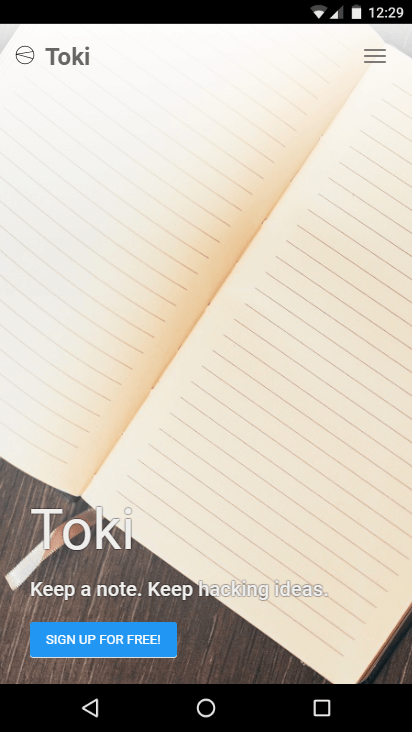
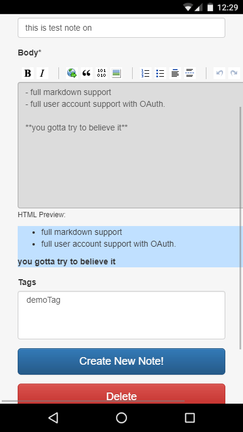
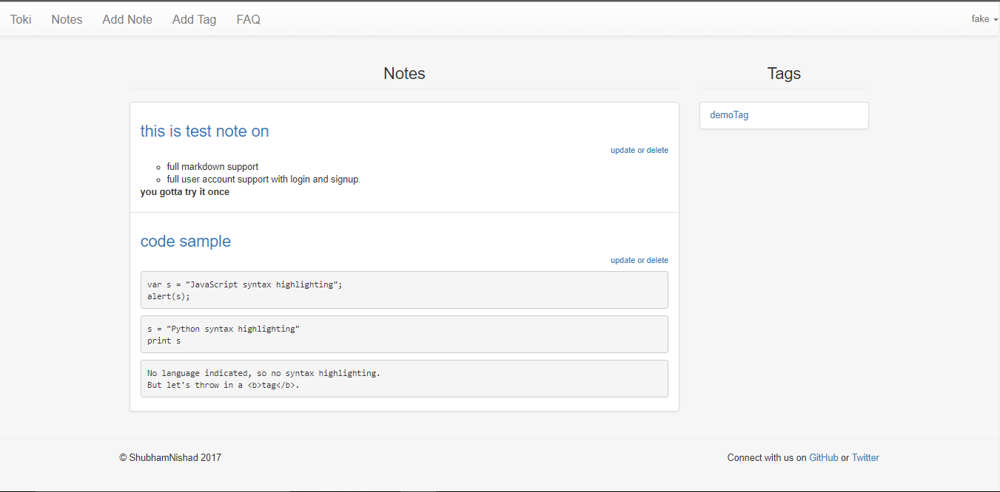
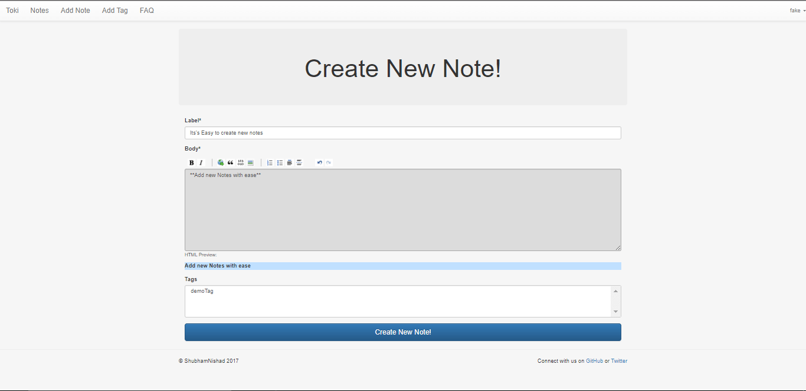
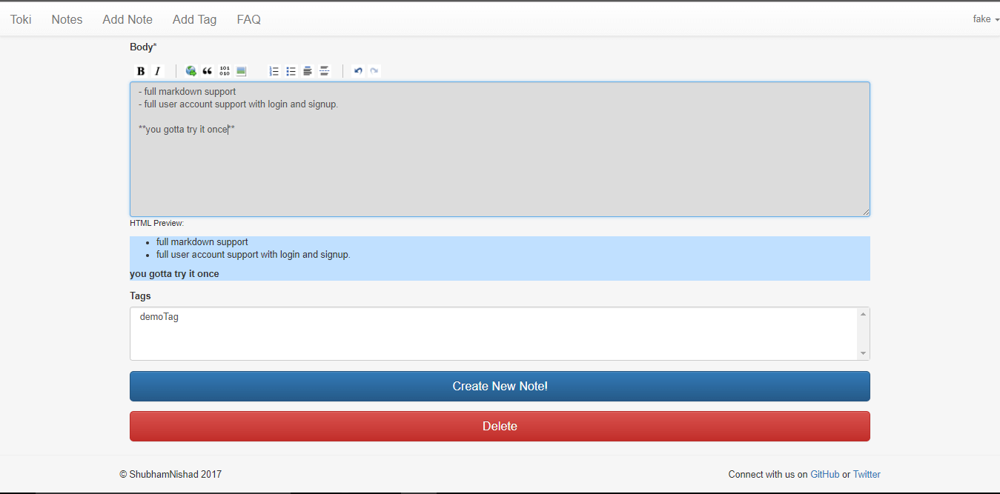
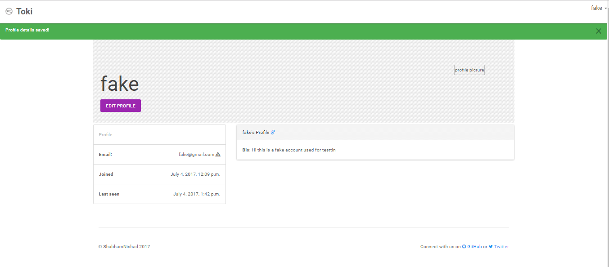
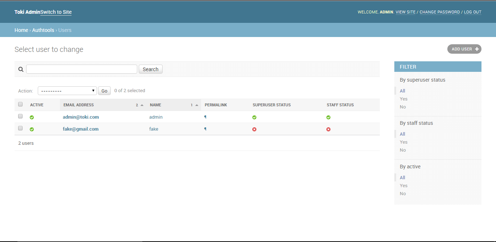
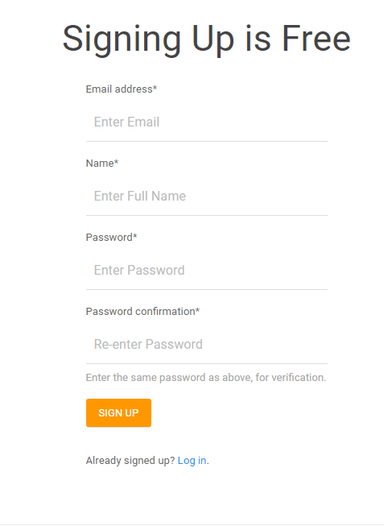

# toki-keep-a-note   
A simple note taking app made with Django. http://toki1.pythonanywhere.com/
##### 

Toki is a simple note taking Django project. It was developed to act as a Hands-on and to increase my experience with a MVC framework(MTV as in the case of Django).

##### 

I was interested in Django from the first time I searched about and after a little investigation I choose Django as the base for this project.

      

## Features of Toki - keep a Note

*   customize notes using the markdown editor.You dont need to know markdown, the editor will help you.
*   You can Rename, Save, Update, Delete notes.
*   support for code blocks and highlighting
*   Fully responsive. use any device and always find the best layout.

## Things I like about Django.

*   Lots and lots of quality packages
*   Full featured web framework
*   Great community support and excellent documentation
*   Really good ORM. It was really easy to work with DB.
*   You can very quickly make a functional web app when you want to test your ideas.

## Things I Learned

*   Working with a MVC or you can say MTV.
*   By doing this project I came to know how Django works and what powers does it has.
*   integrating differnt packages into a single project
*   Database operations on a RDBMS
*   hosting and configuring the project on pythonanwhere.com

## Resources/packages used

*   [django-crispy-forms](http://django-crispy-forms.readthedocs.io/en/latest/): it makes your forms way more beautiful or I should say crispy.
*   [virtualenv](https://virtualenv.pypa.io/en/stable/): its a no-brainer.
*   [django-pagedown](https://github.com/timmyomahony/django-pagedown): provides easy editor for markdown input.
*   many other packages are used, for them do check the requirement file.[link](https://github.com/shubhamnishad97/toki-keep-a-note/blob/master/requirements.txt): 

## How to run the project locally

Download the [zip](https://github.com/shubhamnishad97/toki-keep-a-note/archive/master.zip) or Clone this repository:
`git clone https://github.com/shubhamnishad97/toki-keep-a-note.git`

Install the dependencies by simply executing:
`pip install -r requirements.txt`

Run this command to start the app:
`python manage.py runserver`

Visit `127.0.0.1:8000` on your web browser and don't forget to give me some feedback.

## Screenshots

 
 
 
 

## License [MIT](https://github.com/shubhamnishad97/toki-keep-a-note/blob/master/LICENSE)
